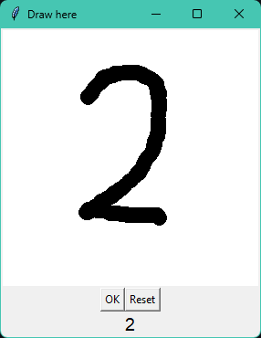

# Multiclass Logistic Regression for Digit Recognition (NumPy Implementation)

This project implements a **multiclass logistic regression model from scratch** using only NumPy. It is used to recognize handwritten digits (0–9) from the MNIST dataset.

## Key Features

- Implements binary and multiclass logistic regression without using any machine learning libraries.
- Reads raw MNIST `.idx` files directly.
- Supports training, prediction, accuracy evaluation, and model export (`.npz`).
- Entirely based on NumPy and built from first principles.

## Project Structure
```
.  
├── train.py            # Main script  
├── scripts.py          # Core logic  
├── process_image.py    # processing image before traing  
├── data/               # MNIST dataset files (.idx format)  
├── model.npz           # Saved model weights (after training)  
├── output.py           # Testing model  
└── README.md  
```

## How It Works

### 1. Data Loading and Processing
The `read_idx()` function loads MNIST data from raw `.idx` files into NumPy arrays.
Each digit will be re-centered be before trainng.
<p align="center">
  
</p>

### 2. Model
A one-vs-all strategy is used for multiclass classification:
- Each digit class (0–9) is trained with a separate binary logistic regression model.
- During prediction, each model produces a probability via sigmoid.
- Final output uses a softmax-like method to choose the most probable class.

### 3. Training
The training logic is built inside the `Z` class (for binary) and `MultinomialLogistic` (for multiclass) 

```bash
python train.py --lr 8 --epoch 10000 -p 0.8 --gpu
# remove --gpu if train on cpu
```

### Tesing
The file `output.py` allows the user to draw and write a digit on the window, then press OK. The result will be returned and printed out.

<p align="center">
  
</p>

This model using Multinomial Logistic Regession so the accurary is about ~92% (after tesing)